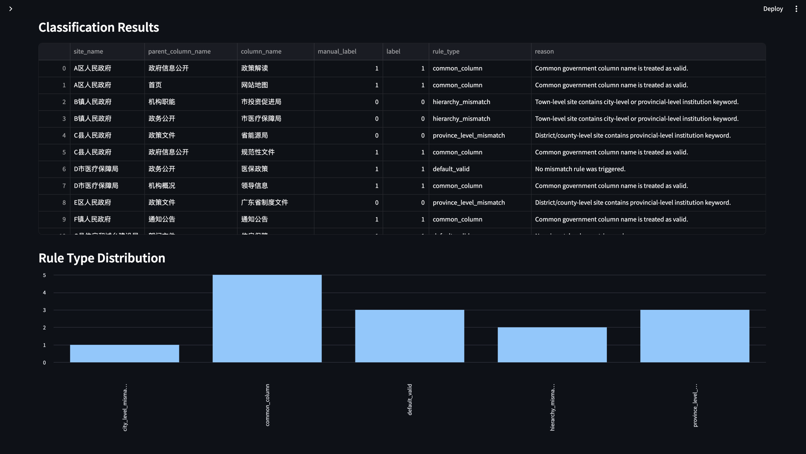
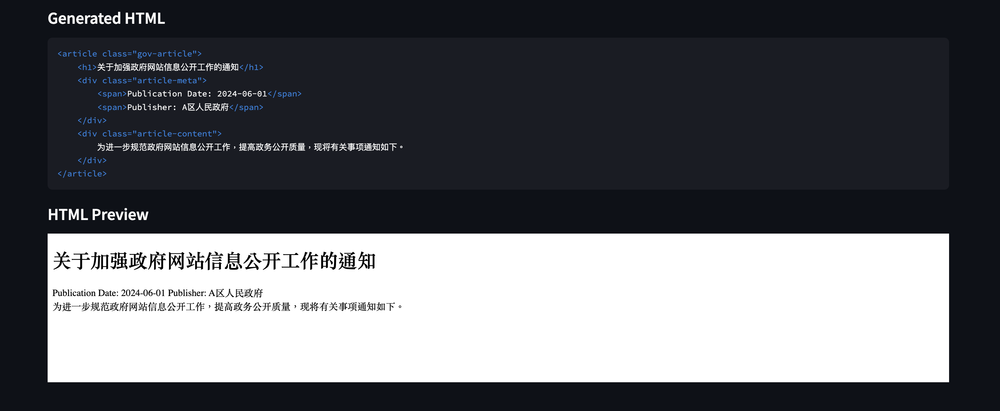

# Chinese Admin Text Classifier

## Overview

This project implements a rule-based Chinese administrative text consistency classifier. It checks whether a website column name is consistent with its corresponding government site name by using administrative hierarchy detection, institution keyword extraction, alias normalization, and explainable rule-based classification.

## Background

This project is an anonymized and simplified reconstruction of a real-world internship task involving government website crawler output validation. The original workflow involved checking whether crawled pages and column names were consistent with their source websites, reviewing machine-generated labels, and formatting crawled article metadata into standardized HTML structures.

To protect data privacy and confidentiality, this repository uses only synthetic examples and does not include any original internship data or code.

## Data Note

The original problem was inspired by real-world data processing experience during an internship. To protect data privacy and confidentiality, all examples in this repository are synthetic or anonymized.

## Current Features

- Chinese administrative level detection
- Rule-based consistency classification
- Explainable prediction output
- Synthetic sample dataset
- Basic pro4ject structure for future Streamlit dashboard and evaluation
- Standardized HTML formatting for crawled article metadata

## Article HTML Formatter

The project also includes a simple HTML formatter that converts crawled article metadata into a standardized HTML structure. The formatter takes an article title, publication date, publisher, and body content as input, and generates both raw HTML code and a rendered preview in the Streamlit app.

This feature reflects a common step in government website crawler workflows, where extracted metadata and article content need to be cleaned and converted into a consistent format for downstream storage or display.

## Demo Screenshots

### Classification Dashboard



### Article HTML Formatter



## Project Structure

```text
chinese-admin-text-classifier/
├── data/
│   └── synthetic_sample.csv
├── src/
│   ├── alias_normalizer.py
│   ├── evaluator.py
│   ├── hierarchy.py
│   ├── preprocess.py
│   └── rule_engine.py
├── notebooks/
├── screenshots/
├── app.py
├── README.md
└── requirements.txt
```

## How to Run

1. Clone this repository:

```bash
git clone https://github.com/Brittany1203/chinese-admin-text-classifier.git
cd chinese-admin-text-classifier
```

2. Install dependencies:
```bash
pip install -r requirements.txt
```

3. Run the streamlit app:
```bash
streamlit run app.py
```

## Project Workflow

1. Load synthetic government website column data.
2. Detect the administrative level of each website.
3. Apply rule-based consistency checks.
4. Generate predicted labels, rule types, and explanation reasons.
5. Compare predictions with manual labels for evaluation.
6. Display results and rule distribution in a Streamlit dashboard.
7. Convert crawled article metadata into standardized HTML format.

## Limitations and Future Work

- The current dataset is synthetic and designed for demonstration purposes.
- The rule engine currently focuses on selected administrative hierarchy mismatch cases.
- Future work may include expanding the institution keyword dictionary, adding alias normalization, improving parent-column logic, and evaluating the system on a larger manually labeled dataset.